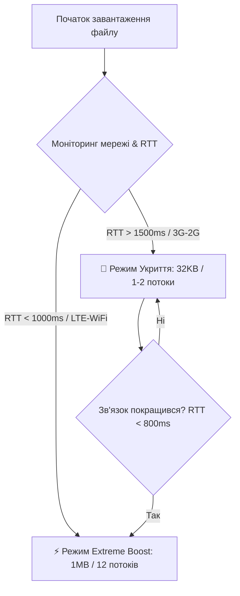

# ⚡ Gomin Speed Engine 2.0: Специфікація та Режим «Укриття»

Братан, якщо тебе заїбало, що Telegram у підвалах, метро чи бомбосховищах поводиться як повне гівно, втрачає сокети та тупить на кожному чанку — читай цей документ. Тут розписано, як ми перетворимо застарілу логіку прискорення мережі на розумний, адаптивний двигун, що автоматично виживає в суворих українських реаліях.

---

## 🚀 1. Що таке Speed Engine 2.0?

Оригінальний Telegram качає файли консервативно: маленькими чанками (128 KB) та в 4 потоки. Для сучасного гігабітного інтернету це повна хуйня.
**Speed Engine 2.0** — це наша мережева надбудова над офіційними класами `FileLoadOperation` та `FileUploadOperation`, яка вижимає максимум із каналу за рахунок паралельного завантаження.

### 📊 Порівняльна таблиця режимів швидкості

| Режим роботи | Розмір чанка (Download) | Кількість потоків (Download) | Черга вивантаження (Upload) | Призначення |
| :--- | :--- | :--- | :--- | :--- |
| **BOOST_NONE** (Дефолт) | 128 KB | 4 потоки | 2 MB (до 4 потоків) | Базова ванільна логіка Telegram |
| **BOOST_AVERAGE** (Баланс) | 512 KB | 8 потоків | 4 MB (до 8 потоків) | Оптимально для мобільного 4G |
| **BOOST_EXTREME** (Гомін) | 1 MB | 12 потоків | 8 MB (до 16 потоків) | Гігабітний Wi-Fi / Повний безліміт |
| **🚨 AUTO_SHELTER** (Укриття) | **32 KB** | **1-2 потоки** | **32 KB (1 потік)** | Бункери, метро, глибокі підвали |

---

## 🛡️ 2. Режим «Укриття» (Shelter Mode) — Автоматичний Fallback

У старому Гоміні режим слабкої мережі (`slowNetwork`) вмикався тупо ручним тумблером у налаштуваннях. Це повний анахронізм: користувач не повинен руками щоразу клацати кнопки, коли спускається в метро чи укриття під час тривоги.

В **Speed Engine 2.0** цей процес стає **повністю автоматичним**:

### 🧠 Як працює автоматика?
За логіку відповідає синглтон-контролер `GominSpeedController`. Він моніторить стан мережі без навантаження на процесор через два незалежних канали:

1. **Пасивний моніторинг RTT (Round Trip Time)**:
   При завантаженні кожного чанка через `FileLoadOperation` мы фіксуємо час початку та завершення запиту.
   * Якщо середній RTT за останні 3 чанки перевищує **1500 мс**, або відсоток таймаутів сокетів (`SocketTimeoutException`) > **30%**, система миттєво кидає прапорець `isShelterModeActive = true`.
2. **Активний моніторинг Android System**:
   Через `ConnectivityManager` контролер відстежує тип підключення:
   * Якщо пристрій переходить на 2G (EDGE) або 3G із низьким рівнем сигналу (через `TelephonyManager` та `CellSignalStrength`), режим «Укриття» активується превентивно.



### ⚡ Логіка відновлення швидкості
Як тільки зв'язок стабілізується (RTT падає нижче **800 мс** на 3-х послідовних запитах, або пристрій переключається на якісну LTE/Wi-Fi мережу), контролер м'яко повертає параметри завантаження до обраного користувачем рівня (наприклад, Extreme Boost).

---

## 🎨 3. Інтерфейс Налаштувань: Чому зник старий пункт?

Раніше в налаштуваннях висів перемикач **"Режим слабкої мережі"**. Оскільки тепер система робить це автоматично, тримати цей тумблер немає жодного сенсу — він тільки засирає екран.

Замість нього ми додаємо велику текстову інформаційну картку (Text Card) безпосередньо у налаштуваннях швидкості. Це дає користувачу чітке розуміння: **Гомін сам дбає про його зв'язок**.

### 📱 Макет UI-блоку в налаштуваннях:

```
┌────────────────────────────────────────────────────────┐
│  ⚡ Speed Engine                                      │
├────────────────────────────────────────────────────────┤
│  Завантаження                           Максимально >  │
│  Прискорення завантаження (Buffer 512KB)     [ Switch ]│
├────────────────────────────────────────────────────────┤
│  ℹ️ Адаптивний режим «Укриття»                          │
│  Гомін автоматично виявляє слабкий сигнал у метро,     │
│  підвалах та бомбосховищах. За низької якості зв'язку   │
│  швидкість динамічно знижується до 1 потоку з чанками  │
│  32 KB для запобігання розривів з'єднання.             │
│  При виході на поверхню максимальна швидкість          │
│  відновлюється автоматично.                            │
└────────────────────────────────────────────────────────┘
```

Для реалізації цієї картки в `GominSettingsEntry.java` ми використовуємо елемент типу `VIEW_TYPE_SHADOW` з текстом:
```java
items.add(UItem.asShadow(
    "ℹ️ Адаптивний режим «Укриття»\n\n" +
    "Гомін автоматично виявляє слабкий сигнал у метро, підвалах та бомбосховищах. " +
    "За низької якості зв'язку швидкість динамічно знижується до 1 потоку з чанками 32 KB, " +
    "щоб завантаження не обривалося через таймаути. При відновленні сигналу максимальна швидкість повертається автоматично."
));
```

---

## 🛠️ 4. Технічний План Реалізації (Крок за кроком)

Жодних брудних хаків — робимо хірургічно точно, обмежуючи прямі зміни в Telegram коді до мінімуму.

### Крок 1: Створення адаптивного контролера
Створюємо новий клас [GominSpeedController.java](file:///G:/Code/Java/Gomin-UA/TMessagesProj/src/main/java/ua/gomin/messenger/speed/GominSpeedController.java):
* Створюємо синглтон `INSTANCE`.
* Логіка збереження ковзного середнього RTT за останні запити.
* Реєстрація `ConnectivityManager.NetworkCallback` для відстеження типу мережі (2G/3G/4G/5G/Wi-Fi).
* Методи `getDownloadChunkSize(int defaultSize)`, `getMaxParallelStreams(int defaultStreams)`, `isShelterModeActive()`.

### Крок 2: Хірургічна інтеграція в завантаження
Впроваджуємо хуки в [FileLoadOperation.java](file:///G:/Code/Java/Gomin-UA/TMessagesProj/src/main/java/org/telegram/messenger/FileLoadOperation.java):
* У методі `updateParams()` викликаємо `GominSpeedController.INSTANCE` для динамічного коригування `downloadChunkSizeBig`, `maxDownloadRequests` та `maxDownloadRequestsBig`.
* У коді обробки завершеного запиту передаємо час виконання запиту до контролера для оновлення RTT.

### Крок 3: Хірургічна інтеграція у вивантаження
Впроваджуємо хуки в [FileUploadOperation.java](file:///G:/Code/Java/Gomin-UA/TMessagesProj/src/main/java/org/telegram/messenger/FileUploadOperation.java):
* Коригуємо розрахунок `uploadChunkSize` та `maxRequestsCount` на основі даних про стан укриття від контролера.
* Забезпечуємо розширення черги вивантаження до 8 МБ (`maxUploadingKBytesBoost = 1024 * 8`) для режиму Extreme Boost.

### Крок 4: Оновлення інтерфейсу налаштувань
Рефакторимо [GominSettingsEntry.java](file:///G:/Code/Java/Gomin-UA/TMessagesProj/src/main/java/ua/gomin/messenger/preferences/GominSettingsEntry.java):
* Видаляємо `slowNetworkModeRow` з коду ініціалізації та обробки кліків.
* Додаємо інформаційний `UItem.asShadow` із детальним описом авто-режиму «Укриття».
